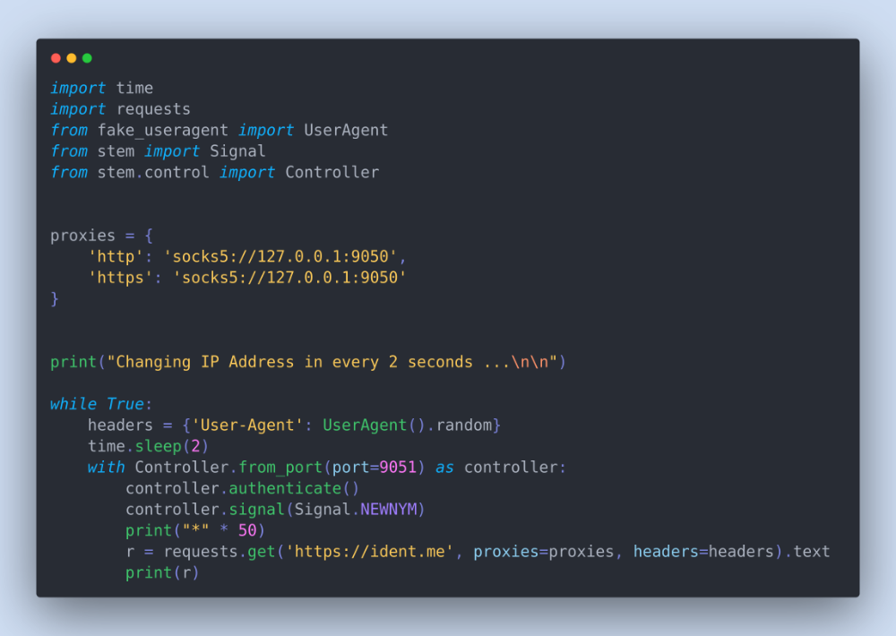
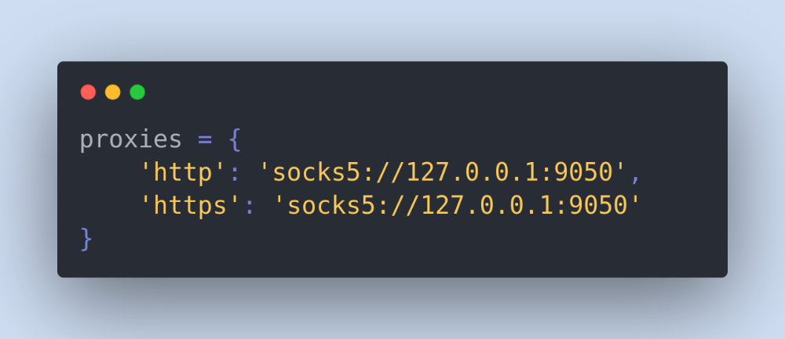
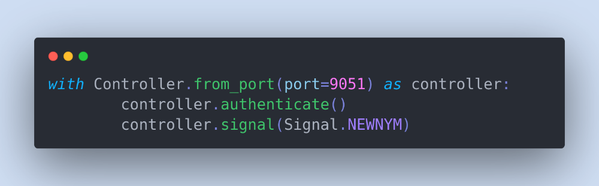
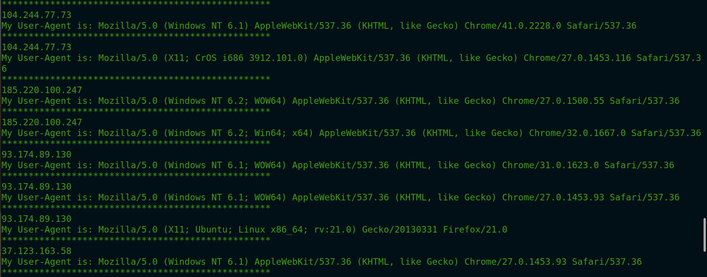

[عوض کردنIP در پایتون - کیبوردی برای آزادی](https://igmag.ir/%D8%A7%D8%B1%D8%B3%D8%A7%D9%84-http-%D8%B1%DB%8C%DA%A9%D9%88%D8%A6%D8%B3%D8%AA-%D8%A8%D8%A7-ip-%D9%87%D8%A7%DB%8C-%D9%85%D8%AE%D8%AA%D9%84%D9%81-%D8%AF%D8%B1-%D9%BE%D8%A7%DB%8C%D8%AA%D9%88%D9%86-j16ype0drq5b)

# عوض کردنIP در پایتون
 
تصور کنید یک **Web Scrapper** ساختید که قراره به یک وبسایت در خواست های خیلی زیاد HTTP بزنه و داده هاشو استخراج کنه. در این طور مواقع وبسایت ممکنه IP شما رو بلاک کنه در این آموزش قراره به شما یاد بدم چطور وبسایت های که **IP Based Restrictions** دارن رو دور بزنید.
 
در این آموزش من از سیستم عامل **Ubuntu 20.04.4** و پایتون ورژن **3.8.10** استفاده میکنم اگه شما هم لینوکس دارید به راحتی میتونید دستورات زیر را وارد کنید اما اگر از ویندوز استفاده میکنید خودتون باید سرچ کنید و نحوه نصب و پیکربندی برنامه ها را پیدا کنید.
 
در اینجا قرار من با استفاده از **Tor** و پایتون IP خودم را پنهان و برای ارسال درخواست از IP های مختلف استفاده کنم. ابتدا بریم سراغ نصب و پیکربندی Tor در لینوکس که ابزار اصلی ما برای پنهان کردن IP میباشد.
 
#### نصب Tor

برای نصب Tor میتونید بسته به سیستم عامل برنامه مورد نظر را از سایت دانلود و نصب کنید. البته آدرس سایت رو من اینجا نذاشتم اما به راحتی میتونید در اینترنت پیدا کنید. اما اگه از لینوکس های دبیان بیس استفاده میکنید به راحتی میتونید با دستورات زیر نصب کنید.
```sh
sudo apt-get install tor
``` 
حالا برای اجرای برنامه دستور زیر را وارد کنید.
```sh 
sudo service tor start
``` 
برای اینکه بفهمید برنامه به درستی نصب و اجرا شده دستور زیر را ترمینال خودتون وارد کنید.
```sh 
curl --socks5 localhost:9050 --socks5-hostname localhost:9050 -s https://check.torproject.org/ | cat | grep -m 1 Congratulations | xargs
``` 
اگر برنامه به درستی اجرا شده باشد باید پیغام زیر را به شما نمایش بده.
```sh 
Congratulations. This browser is configured to use Tor.
``` 
#### نصب پکیج های مورد نیاز پایتون
```sh 
sudo pip3 install requests 
sudo pip3 install 'requests\[socks\]'
sudo pip3 install 'requests\[security\]'
sudo pip3 install cryptography
``` 
خب حالا کد ایتور خودتون رو باز کنید و کد زیر رو وارد کنید تا IP واقعی خودتون رو بینید.
```py 
import requests
 
res = requests.get('https://ident.me').text
print(f"My IP Address is: {res}")
``` 
اینجا ما از سرویس **[ident.me](https://ident.me/)** استفاده میکنیم تا IP خودمون رو بدست بیاریم اگه الان وارد سایت بشید میتونید IP خودتون رو ببینید.
 
#### ساخت هویت جدید
 
وقتشه دیگه همه چیز رو کنار هم بذاریم و با هویت جدیدمون در اینترنت دیده بشیم اما قبل از اون هنوز به نصب چند تا پکیج و یکم پیکربندی نیاز داریم. برای اینکه بتونیم هر بار که با پایتون درخواست میدیم از IP جدیدی استفاده کنیم باید از **“Stem”** که controller پایتون برای Tor هستش را ابتدا نصب کنیم.
 
#### محکم کاری بیشتر

برای اینکه هویت خودمون رو یکم بیشتر مخفی کنیم از کتابخونه **“Fake UserAgent”** استفاده میکنم که به ما این امکان رو میده هر بار با **User Agent** های مختلف درخواست خودمون رو ارسال کنیم و در مجموع اون سروری که قراره ما بهش درخواست بفرستیم فکر میکنه هر بار یک IP و مرورگر های مخلتف داره بهش درخواست رو میفرسته :)))) زیبا نیست, خب بریم سراغ نصب پکیج ها
```sh 
sudo pip3 install stem
sudo pip3 install fake\_useragent
``` 
حالا باید کنترل کننده Tor را برای درخواست تجدید هویت پیکربندی کنیم. برای این کار به فایل زیر برید.
```sh 
sudo nano /etc/tor/torrc
``` 
حالا دستورات زیر را در انتهای فایل وارد و سیو کنید.
```sh 
ControlPort 9051 
CookieAuthentication 1
``` 
و در نهایت Tor را ری استارت کنید تا پیکربندی های جدید اعمال شود.
```sh 
sudo service tor restart
``` 
 



مهمترین قسمت های این کد این دو قسمت هستند.
 


در اینجا ما به کتابخونه requests میگیم که تمام درخواست ها رو ازین مسیر رد کنه, یعنی چی؟ به این کار میگن پروکسی کردن با این کار ما ابتدا درخواست رو به برنامه Tor میدیم که در مسیر 127.0.0.1 و پورت 9050 درحال شنود است. و برنامه Tor درخواست رو میگیره و هر بار با IP های مختلف اون رو ارسال میکنه.
 


و در اینجاست که هر بار IP جدیدی برای ما ساخته میشه.
 


اگه برنامه رو اجرا کنید میتونید IP هایی که درخواست شما باهاش فرستاده میشه رو ببینید.

امیدوارم که این آموزش به کارتون بیاد برای خودتون که خیلی مفید بود چون تونستم اطلاعات کلی سایت رو جارو کنم :)))
