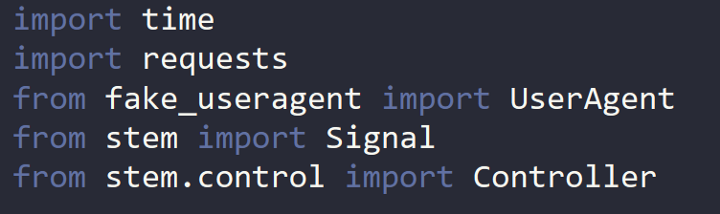
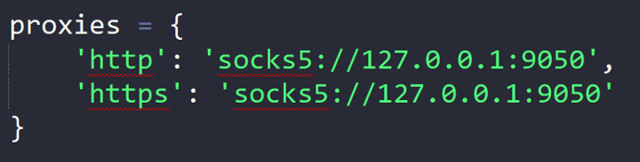
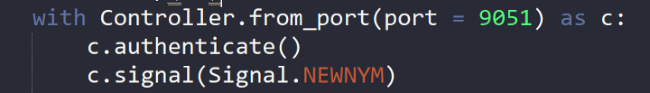
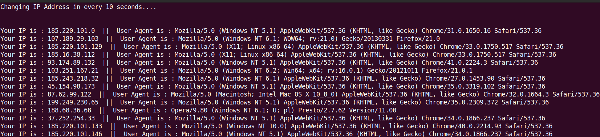

[Configuring TOR with Python. Mask Your IP Address using a Python… | by Mayank Pandey | Aug, 2022 | InfoSec Write-ups](https://infosecwriteups.com/configuring-tor-with-python-1a90fc1c246f)

# Configuring TOR with Python

## Mask Your IP Address using a Python Script

If you ever built a web scrapper then you must have faced the issue of being blocked by web servers for generating too many requests, or you Just wanted to hide your Real IP Address and automate your scripts.

In this article, I will explain how to configure TOR on your Linux System and How to implement TOR in a Python script to Mask your Real IP and Bypass IP Based Restrictions.


# What is TOR?

For Those who are new to Hacking and Programming _“Tor, short for The Onion Router, is free and open-source software for enabling anonymous communication”._ **_Tor network is a secure, encrypted protocol that can ensure privacy for data and communications on the web_**_._

The Tor service/browser works **by using a technology known as onion routing**. The onion router is a peer-to-peer (P2P) overlay network that enables users to browse the internet anonymously. Onion routing uses multiple layers of encryption to conceal both the source and destination of information sent over the network.

The TOR Network is usually accessed using the TOR Browser, but what if you wanted to use it in your Python Scripts and run Automation scripts over the TOR Network? **That's exactly what we are going to do today!!**

# Tor installation

The installation of Tor depends on your system and is detailed on the official [website](https://www.torproject.org/download/). For Most Debian Based systems this will work.
```sh
sudo apt-get install tor
```
To launch Tor, run:
```sh
sudo service tor start
```
To check if it works, simply run the following command from a terminal:
```sh
curl --socks5 localhost:9050 --socks5-hostname localhost:9050 -s https://check.torproject.org/ | cat | grep -m 1 Congratulations | xargs
```
If everything works fine You will get this output.
```txt
Congratulations. This browser is configured to use Tor.
```
# Configuring with Python

Python Requests Module will be used to send Requests over TOR Network.
```sh
sudo pip3 install requests  
sudo pip3 install requests[socks]  
sudo pip3 install requests[security]  
sudo pip3 install cryptography
```
We can now use to requests module.
```py
import requests
```
You can check your IP address without Tor with the command:
```py
requests.get('https://ident.me').text
```
The Output will be your Original IP Address.

To Use the TOR network inside Python Scripts we first need to tell python to use a Proxy.
```py
proxies = {  
    'http': 'socks5://127.0.0.1:9050',  
    'https': 'socks5://127.0.0.1:9050'  
}
```
Now, you should have a new IP address with:
```py
requests.get('https://ident.me', proxies=proxies).text
```
# Getting New Identity

We need to get New IP address every time we make a new request or at fixed time intervals, For this, we need a Python Module called **“Stem”.**

The stem is a Python controller library for [**Tor**](https://www.torproject.org/). With it, you can use Tor’s [**control protocol**](https://gitweb.torproject.org/torspec.git/tree/control-spec.txt) to script against the Tor process.

For more anonymity, we can generate a new User Agent for Every request using the **“Fake UserAgent”** Module. Both of these modules Can be Installed using pip.
```sh
sudo pip3 install stem  
sudo pip3 install fake_useragent
```
The Tor controller must also be configured to request identity renewal.
```sh
sudo nano /etc/tor/torrc
```
Save the following lines in the `/etc/tor/torrc` file.
```sh
ControlPort 9051  
CookieAuthentication 1
```
Then we restart Tor to take into account these modifications:
```sh
sudo service tor restart
```
# Packing it all in a Script

We now have everything ready all we need to do is to pack these things in a Script.

First of all, we need to import the needed modules.



After importing the modules we define our proxy.



Now we will define a Handler for our Stem Controller. Using this handler we will Authenticate our Requests and Generate Signals to get a New IP address.



_Here is the Full Code_

```py
import time
import requests
from fake_useragent import UserAgent
from stem import Signal
from stem.control import Controller
proxies = {
    'http': 'socks5://127.0.0.1:9050',
    'https': 'socks5://127.0.0.1:9050'
}
print("Changing IP Address in every 10 seconds....\n\n")
while True:
    headers = { 'User-Agent': UserAgent().random }
    time.sleep(10)
    with Controller.from_port(port = 9051) as c:
        c.authenticate()
        c.signal(Signal.NEWNYM)
        print(f"Your IP is : {requests.get('https://ident.me', proxies=proxies, headers=headers).text}  ||  User Agent is : {headers['User-Agent']}")
```

This code will generate a New IP Address every 10 seconds with a fresh User Agent in every Request.



## Use Cases for this Tool
 
There are many Scenarios in which this can be used, it can be used as a base to create many amazing tools to solve problems like

-   Scraping Normal Web Without Getting Blocked
-   Making a Dark Web Scraper
-   Tool to Mask IP Address
-   And Many More…..